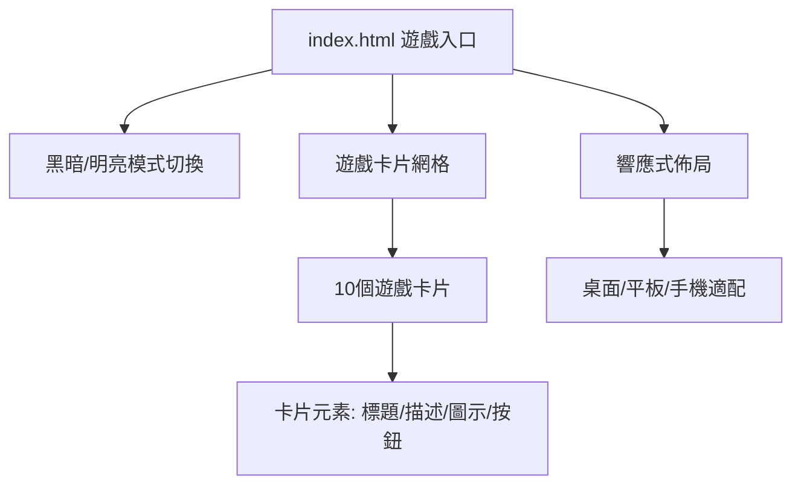

# index.html 合併與遊戲入口計劃

## 任務概述
將 `game_loading_screen_dark_mode/code.html` 和 `game_loading_screen_light_mode/code.html` 合併為單一的 `index.html`，並添加所有遊戲的連結作為遊戲入口主頁。

## 分析結果

### 現有遊戲檔案 (共10個)
1. `air_hockey.html` - 雙人冰球
2. `block_blast.html` - Block Blast! Pro
3. `chinese_chess.html` - 中國象棋
4. `dino_hunter.html` - 侏羅紀恐龍狩獵
5. `fruit_ninja.html` - 手勢水果忍者
6. `gomoku.html` - 五子棋
7. `snack.html` - 貪食蛇遊戲
8. `telekinesis.html` - 念力大師
9. `tic_tac_toe.html` - 雙人井字棋
10. `touch_pong.html` - 雙人乒乓球

### 現有載入畫面特點
- **黑暗模式**: 深色背景、網格圖案、圓形進度指示器、霓虹效果
- **明亮模式**: 淺色背景、徑向網格、高科技旋轉器、漸變色彩

## 設計架構

### 1. 統一設計方案


### 2. 技術規格
- **框架**: Tailwind CSS (使用現有配置)
- **字體**: Space Grotesk (正文字體) + Orbitron (標題字體)
- **色彩系統**:
  - 主要色: `#00f2ff` (霓虹藍)
  - 次要色: `#7000ff` (霓虹紫)
  - 強調色: `#ff00c8` (霓虹粉)
  - 背景色: `#05070a` (黑暗模式), `#f5f8f8` (明亮模式)
- **模式切換**: 基於 `class="dark"` 的 Tailwind 黑暗模式

### 3. 頁面結構
```
<!DOCTYPE html>
<html lang="zh-TW" class="dark">
<head>
    <!-- Meta tags, title, Tailwind CSS, fonts -->
    <!-- 統一的 tailwind.config -->
    <!-- 自定義 CSS: 網格背景、霓虹效果 -->
</head>
<body>
    <!-- 頂部導航欄 -->
    <header>
        - 網站標誌 "BillyWa's Center"
        - 導航連結 (GAMES, STORE, COMMUNITY, SUPPORT)
        - 黑暗/明亮模式切換按鈕
        - 用戶頭像
    </header>

    <!-- 主內容區 -->
    <main>
        <div class="hero-section">
            <h1>遊戲中心</h1>
            <p>選擇遊戲開始遊玩</p>
        </div>

        <div class="games-grid">
            <!-- 10個遊戲卡片 -->
            <div class="game-card">
                <div class="game-icon">🎮</div>
                <h3>遊戲名稱</h3>
                <p>遊戲描述</p>
                <a href="game.html" class="play-button">開始遊戲</a>
            </div>
            <!-- 重複其他遊戲 -->
        </div>
    </main>

    <!-- 頁腳 -->
    <footer>
        - 版本資訊 v2.4.0-STABLE
        - 伺服器狀態
        - 版權資訊
    </footer>
</body>
</html>
```

## 實施步驟

### 階段一: 基礎架構
1. 創建新的 `index.html` 檔案
2. 整合兩個載入畫面的 Tailwind 配置
3. 建立統一的 CSS 變數和樣式
4. 實現黑暗/明亮模式切換邏輯

### 階段二: 遊戲卡片系統
1. 設計響應式遊戲卡片網格 (3列桌面, 2列平板, 1列手機)
2. 為每個遊戲創建卡片組件
3. 添加遊戲圖示和描述
4. 實現卡片懸停動畫效果

### 階段三: 遊戲資料整合
1. 為每個遊戲檔案建立映射:
   ```javascript
   const games = [
     { file: "snack.html", title: "貪食蛇遊戲", desc: "經典貪食蛇挑戰", icon: "🐍", category: "SOLO" },
     { file: "air_hockey.html", title: "雙人冰球", desc: "實體物理碰撞對戰", icon: "🏒", category: "VERSUS" },
     // ... 其他遊戲
   ]
   ```
2. 動態生成遊戲卡片或靜態編寫

### 階段四: 測試與驗證
1. 測試黑暗/明亮模式切換功能
2. 驗證所有遊戲連結正確
3. 測試響應式設計在不同裝置上的表現
4. 確認與現有遊戲的返回連結相容性

## 相容性考量

### 現有遊戲的返回連結
- 所有現有遊戲都有 `← 回到遊戲入口` 連結指向 `index.html`
- 需要確保新的 `index.html` 檔案路徑正確
- 建議保持相同的 CSS 類名 `.back-link` 以維持一致性

### 技術相容性
- 使用相同的 Tailwind CDN 版本
- 保持 Material Symbols 圖示庫
- 維持相同的字體載入方式

## 預期成果

1. **統一的遊戲入口**: 單一 `index.html` 作為所有遊戲的起點
2. **完整的主題支援**: 黑暗/明亮模式無縫切換
3. **響應式設計**: 在所有裝置上完美顯示
4. **完整遊戲覆蓋**: 所有10個遊戲都有可點擊的卡片
5. **視覺一致性**: 與現有遊戲設計風格匹配

## 後續優化建議

1. 添加遊戲搜尋功能
2. 實現遊戲分類篩選 (SOLO/VERSUS/MIND)
3. 添加遊戲評分或遊玩次數統計
4. 實現最近遊玩遊戲記錄
5. 添加遊戲預覽圖或影片

---

## 確認事項

請確認以下設計決策:
1. ✅ 使用黑暗模式的色彩系統作為基礎
2. ✅ 整合兩個載入畫面的最佳設計元素
3. ✅ 採用卡片式網格佈局展示遊戲
4. ✅ 保持與現有遊戲的返回連結相容性

是否滿意這個計劃？還是需要調整任何部分？